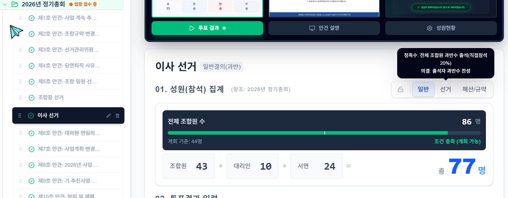
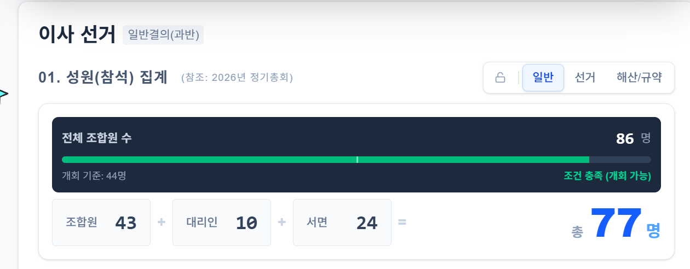

# VoteCast 운영자 테스트 체크리스트

목적: 실제 총회 운영 전에 `체크인`, `총회 관리자`, `프로젝터` 화면이 현재 규칙대로 동작하는지 빠르게 점검한다.

## 1. 사전 확인

- `active meeting`이 관리자에서 올바른 총회 폴더로 열려 있는지 확인
- 테스트 대상 안건에 `일반`, `선거`, `해산/규약` 타입이 각각 존재하는지 확인
- 테스트용 조합원 3명 이상 준비
- 아래 조합원 역할을 임시로 정해두기
  - A: 본인 참석
  - B: 서면결의 또는 우편투표
  - C: 대리 참석

## 2. 체크인 기본 동작

### 2-1. 신규 접수

- `/checkin`에서 미접수 조합원을 선택한다.
- `본인`으로 저장한다.
- 목록 카드에 `[본인]` 배지가 보이는지 확인한다.
- 상세 통계의 `직접` 숫자가 1 증가하는지 확인한다.

### 2-2. 대리 접수

- 다른 조합원을 선택한다.
- `대리`를 선택하고 대리인 이름을 입력한다.
- 목록 카드에 `[대리]` 배지와 괄호 속 대리인 이름이 보이는지 확인한다.
- 상세 통계의 `대리` 숫자가 증가하는지 확인한다.

### 2-3. 선거만 접수

- 다른 조합원을 선택한다.
- 총회 의결권은 `없음`, 선거 참여는 `현장` 또는 `우편투표`로 저장한다.
- 목록 카드에 `[선거]`만 보이는지 확인한다.
- `복합 포함 전체 처리`는 증가하지만 `총회 참석` 수는 증가하지 않는지 확인한다.

## 3. 서면결의 테스트

### 3-1. 서면결의 목록 검증

- `/checkin`에서 `서면`을 선택한다.
- `서면 결의` 목록에 `선거` 안건이 보이지 않는지 확인한다.
- `일반`, `해산/규약` 안건만 보이는지 확인한다.

### 3-2. 서면결의 저장

- 모든 총회 안건에 `찬성/반대/기권`을 입력한다.
- 저장 후 `/admin` 일반 안건에서 `서면(고정)` 수치가 반영되는지 확인한다.
- `/admin` 선거 안건에서는 방금 입력한 서면결의가 끼어들지 않는지 확인한다.

### 3-3. 서면결의 수정

- 방금 접수한 조합원의 `수정` 버튼을 누른다.
- 기존 서면 선택값이 다시 채워져 있는지 확인한다.
- 한두 안건의 찬반을 바꿔 저장한다.
- `/admin` 일반 안건 집계가 즉시 바뀌는지 확인한다.

## 4. 우편투표 테스트

### 4-1. 우편투표 목록 검증

- `/checkin`에서 `우편투표`를 선택한다.
- `우편투표 입력`에는 `선거` 안건만 보이는지 확인한다.
- 일반 안건이나 해산/규약 안건이 보이지 않는지 확인한다.

### 4-2. 우편투표 저장

- 모든 선거 안건에 `찬성/반대/기권`을 입력한다.
- 저장 후 `/admin` 선거 안건에서 `우편투표(고정)` 값이 증가하는지 확인한다.
- `/admin` 일반 안건에서는 이 값이 서면결의 쪽에 반영되지 않는지 확인한다.

### 4-3. 우편투표 수정

- 이미 우편투표한 조합원의 `수정` 버튼을 누른다.
- 기존 우편투표 값이 다시 채워지는지 확인한다.
- 한 안건의 값을 바꿔 저장한다.
- `/admin` 선거 안건 집계가 즉시 바뀌는지 확인한다.

## 5. 복합 접수 테스트

### 5-1. 선거 + 본인

- `본인` + `현장`으로 저장한다.
- 목록 카드에 `[선거] [본인]` 배지가 함께 보이는지 확인한다.
- `/admin` 선거 안건에서 현장 입력 가능 인원이 맞는지 확인한다.

### 5-2. 선거 + 대리

- `대리` + `현장` 또는 `우편투표`로 저장한다.
- 목록 카드에 `[선거] [대리]`가 보이는지 확인한다.
- 대리인 이름이 유지되는지 확인한다.

### 5-3. 서면 + 우편투표

- `서면` + `우편투표`로 저장한다.
- 총회 안건은 서면결의로만 반영되는지 확인한다.
- 선거 안건은 우편투표로만 반영되는지 확인한다.
- 같은 안건이 두 집계에 중복되지 않는지 확인한다.

## 6. 관리자 화면 점검

### 6-1. 일반 안건

- `/admin`에서 일반 안건을 선택한다.
- `성원(참석) 집계`가 `조합원 + 대리인 + 서면`으로 보이는지 확인한다.
- `투표 구성`이 `서면 + 현장`으로 보이는지 확인한다.
- 고정 컬럼명이 `서면(고정)`인지 확인한다.

### 6-2. 선거 안건

- `/admin`에서 선거 안건을 선택한다.
- `성원(참석) 집계`가 `조합원 + 대리인 + 우편투표`로 보이는지 확인한다.
- `투표 구성`이 `우편투표 + 현장`으로 보이는지 확인한다.
- 고정 컬럼명이 `우편투표(고정)`인지 확인한다.

### 6-3. 선거 검증 경고

- 우편투표 입력 일부를 의도적으로 누락한다.
- `/admin` 선거 안건에서 `우편투표 미입력` 경고가 뜨는지 확인한다.
- 현장 입력 가능 인원보다 많이 입력하면 초과 경고가 뜨는지 확인한다.
- 경고가 있으면 `안건 결과 최종 확정` 버튼이 비활성화되는지 확인한다.

## 7. 프로젝터 화면 점검

- `/projector` 또는 `/projector/quorum`에서 선거 안건을 선택한다.
- `서면` 대신 `우편투표` 기준 문구가 보이는지 확인한다.
- 일반 안건은 여전히 `서면` 기준으로 보이는지 확인한다.

## 8. 취소 테스트

### 8-1. 일반 접수 취소

- 본인 또는 대리 접수한 조합원을 취소한다.
- 목록 카드 배지가 사라지는지 확인한다.
- 통계 숫자가 즉시 감소하는지 확인한다.

### 8-2. 서면결의 취소

- 서면결의 조합원을 취소한다.
- `/admin` 일반 안건의 `서면(고정)` 수치가 감소하는지 확인한다.

### 8-3. 우편투표 취소

- 우편투표 조합원을 취소한다.
- `/admin` 선거 안건의 `우편투표(고정)` 수치가 감소하는지 확인한다.

## 9. 최종 합격 기준

- 선거 안건이 서면결의 목록에 노출되지 않는다.
- 선거 안건이 서면 집계에 포함되지 않는다.
- 우편투표는 선거 안건에서만 집계된다.
- 수정 기능으로 기존 상세값을 다시 열고 저장할 수 있다.
- 취소 시 서면결의와 우편투표가 함께 정리된다.
- 일반 안건과 선거 안건의 관리자 화면 문구와 집계 기준이 서로 섞이지 않는다.

## 10. 장애 발생 시 우선 확인

- 안건 타입이 `majority / twoThirds / election / folder` 중 하나인지 확인
- 해당 총회가 현재 `active meeting`으로 열려 있는지 확인
- `/admin`에서 해당 안건이 `일반`인지 `선거`인지 다시 확인
- Supabase SQL Editor에서 최근 적용 SQL이 모두 실행되었는지 확인
  - `add_mail_election_vote_rpc_support.sql`
  - `exclude_election_agendas_from_written_votes.sql`
  - `add_replace_check_in_member_rpc.sql`
